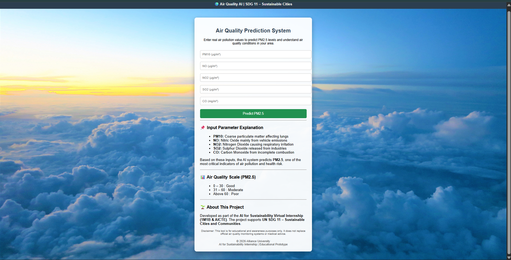
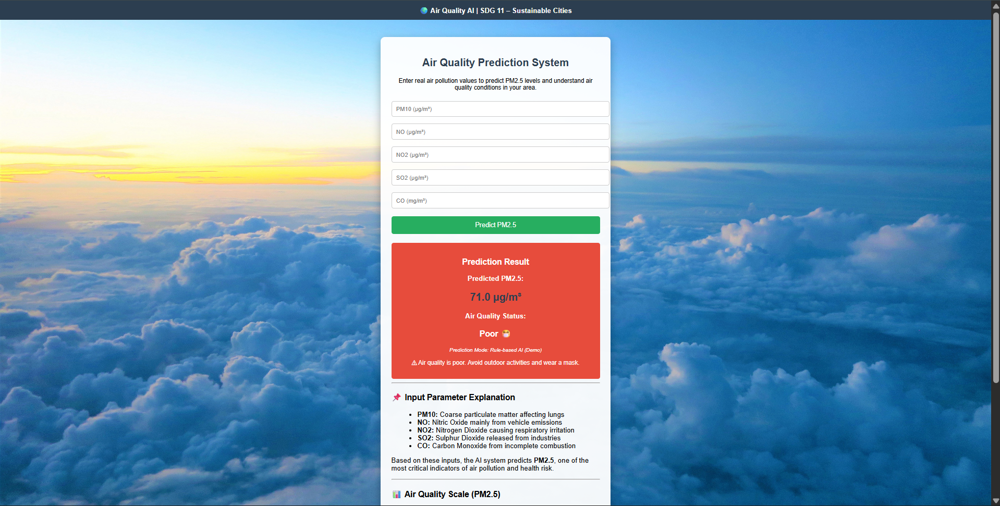

# 🌍 AI-Based Air Quality Prediction System

This project was developed as part of the **AI for Sustainability Virtual Internship (1M1B & AICTE)**.

---

# 📌 Problem Statement

How might we use Artificial Intelligence to predict air pollution levels so that cities can take early action to protect public health and promote sustainability?

---

# 🎯 SDG Alignment

## **SDG 11 – Sustainable Cities and Communities**

This project promotes awareness of air pollution and supports sustainable urban living.

---

# 💡 Solution Overview

The system predicts **PM2.5 air quality levels** using pollution parameters such as:

- PM10
- NO
- NO2
- SO2
- CO

A Flask-based web application allows users to enter pollution values and instantly view:

- Predicted PM2.5 value
- Air quality category
- Health advisory message

---

# 🛠 Tech Stack

- Python
- Flask
- Pandas
- Scikit-learn
- HTML & CSS
- GitHub
- Render (Hosting)

---

# ✨ Features

✅ AI-based PM2.5 prediction  
✅ User-friendly web interface  
✅ Air quality classification  
✅ Health advisory messages  
✅ SDG-based sustainability awareness  
✅ Responsive and clean UI  

---

# 🌐 Live Demo

## Hosted Website
👉 https://ai-air-quality-prediction.onrender.com

## GitHub Repository
👉 https://github.com/koushik140106/AI-Air-Quality-Prediction

---

# 📷 Project Screenshots

## Home Page



---

## Prediction Result



---

# 🚀 How to Run the Project

1. Clone the repository

```bash
git clone https://github.com/koushik140106/AI-Air-Quality-Prediction.git
